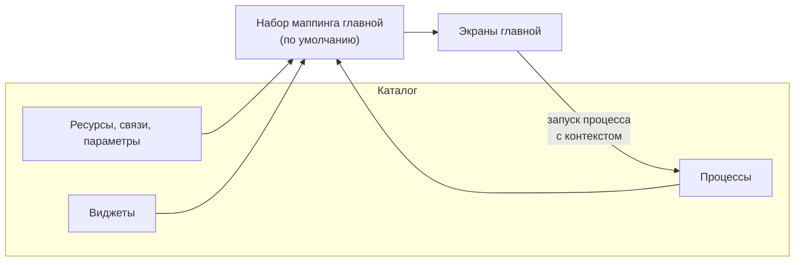

Главная — рабочее пространство разработчиков и владельцев систем в Deckhouse Development Portal (DDP, портал).
На ней собраны команды, системы и их интеграции, микросервисы, окружения, развёртывания, общие ресурсы и потребление ресурсов кластера.
С главной пользователи создают микросервисы из шаблонов, разворачивают их на окружения, заказывают ресурсы и обновляют микросервисы до новых версий шаблонов.


Главная — экспериментальная функциональность. Состав разделов, структура правил маппинга и API могут измениться в следующих выпусках без сохранения обратной совместимости.


Описание экранов с точки зрения пользователя — в [руководстве пользователя по главной](../../user/home/overview/).

## Принцип работы

Главная не хранит собственных данных. Все объекты, которые она показывает, — это сущности каталога, а все действия — это процессы каталога.
Какие ресурсы, связи, параметры, процессы и виджеты использовать, задают правила маппинга.

Правила маппинга сопоставляют понятиям главной объекты каталога:

- **роль ресурса** — ресурс каталога, сущности которого главная показывает как системы, микросервисы, окружения и т. п.;
- **роль связи** — связь каталога, по которой главная находит, например, микросервисы системы или окружение развёртывания;
- **роль свойства** — идентификатор параметра сущности, из которого главная читает, например, язык микросервиса или домен окружения;
- **слот действия** — процессы, которые запускаются с главной кнопкой или пунктом меню, например «Создать окружение»;
- **действие по шаблону** — процесс, который выполняет действие над микросервисом, созданным из конкретного шаблона;
- **слот виджета** — виджет, который главная показывает в фиксированном месте экрана.

Схема ниже показывает, как данные каталога попадают на экраны главной:

Роли не привязаны к конкретным идентификаторам ресурсов: главную можно подключить к любой модели каталога, в которой есть нужные ресурсы и связи.
Готовую модель каталога и правила маппинга для неё создаёт набор данных «Каноничная архитектура (схема)», который применяется [мастером первоначальной настройки](setup/).

Полный перечень ролей, слотов и правил их заполнения — в разделе [«Правила маппинга»](mapping/).

## Набор маппинга по умолчанию

Правила маппинга хранятся в наборах маппинга главной. В портале может быть несколько наборов, но главная использует только один — набор по умолчанию.

Главная выбирает набор в следующем порядке:

1. Набор, у которого включён переключатель «По умолчанию для главной».
1. Набор с идентификатором `home-default`.
1. Первый набор в списке.

Набором по умолчанию может быть только один набор. Когда другой набор становится набором по умолчанию, признак у предыдущего снимается автоматически.
Набор по умолчанию нельзя удалить.

Правила маппинга действуют для всех пользователей портала. Выбрать другой набор на главной пользователь не может.

## Включение главной

Главная выключена после установки портала: вкладка «Главная» скрыта у всех пользователей, а адреса страниц главной перенаправляют в каталог.

Чтобы включить главную:

1. Перейдите в раздел «Администрирование» → «Справочники» → «Правила маппинга».
1. Включите переключатель «Показывать главную».

Переключатель действует сразу для всех пользователей. Для его изменения требуется разрешение `update:home-mapping-sets`.

При включении главной у пользователей в верхней панели появляется вкладка «Главная», а при переходе на неё открывается раздел «Команды».


Баннер «Платформа готова к настройке», из которого запускается мастер первоначальной настройки, отображается на главной.
Пока главная выключена, мастер доступен только в разделе «Администрирование» → «Справочники» → «Наборы данных».


## Разделы главной

Разделы главной сгруппированы в боковом меню. Для работы каждого раздела нужны свои роли маппинга; если основная роль раздела не сопоставлена ресурсу каталога, в разделе отображается сообщение «Настройте правила маппинга или примените набор данных «Каноничная архитектура»».

В таблице перечислены разделы, их основные роли ресурсов и слоты действий:

| Группа | Раздел | Роли ресурсов | Слоты действий и действия по шаблонам |
| --- | --- | --- | --- |
| Организация | «Команды» | Команды портала; `system`, `microservice` | — |
| Архитектура | «Системы» | `system`, `microservice`, `shared_resource`, `deployment`, `environment`, `cluster`, `integration` | — |
| Архитектура | «Интеграции» | `system`, `integration` | — |
| Архитектура | «Диаграммы» | `system`, `microservice`, `shared_resource` | — |
| Архитектура | «Кластеры и сети» | `cluster`, `environment` | — |
| Архитектура | «Как работает платформа» | `guide` | — |
| Разработка | «Создать микросервис» | `system`, `vcs_namespace` | Действие по шаблону «Создать микросервис» |
| Разработка | «Микросервисы» | `microservice`, `system`, `shared_resource`, `deployment`, `environment`, `cluster` | Действие по шаблону «Обновить микросервис из шаблона»; слоты виджетов вкладок «Пайплайны» и «MRs» |
| Разработка | «Развертывание систем» | `system`, `microservice`, `environment`, `shared_resource`, `ingress`, `deployment` | `deploy_microservice`, `delete_microservice`, `order_resource`, `connect_shared_resource`, `disconnect_shared_resource`, `delete_shared_resource`; действия по шаблону «Развернуть микросервис на окружение» и «Удалить микросервис с окружения» |
| Разработка | «Заказ ресурсов» | `shared_resource`, `system` | `order_resource`, `delete_shared_resource` |
| Разработка | «Окружения» | `environment` | `create_environment`, `delete_environment` |
| Разработка | «Потребление ресурсов» | `deployment` | — |

Разделы «DORA и SDLC метрики», «Затраты на эксплуатацию», «Адаптация платформы», «Требования к системам», «Сборка и Доставка», «Troubleshooting хаб» и все разделы группы «Безопасность» отмечены в меню меткой «TBD».
При открытии такого раздела отображается сообщение «Раздел пока недоступен».

## Права доступа

Главная использует общую ролевую модель портала. Отдельной роли для главной нет: что увидит и сможет сделать пользователь, определяют его разрешения на сущности, процессы и настройки главной.

В таблице перечислены разрешения, которые влияют на работу главной:

| Разрешение | Где используется |
| --- | --- |
| `read:entities` (глобальное или на ресурс) | Загрузка сущностей для всех разделов. Если сущности ресурса недоступны пользователю, раздел выглядит так же, как при несопоставленной роли |
| `read:processes` | Загрузка процессов слотов действий. Процесс, недоступный пользователю, не отображается в слоте |
| `control:processes` (глобальное, на ресурс или на сущность) | Запуск процессов с главной. Кнопки запуска не блокируются; при отсутствии разрешения портал возвращает ошибку «Запрещено политиками доступа» |
| `update:entities` или разрешение `update:entity` на сущность | Изменение домена окружения в разделе «Окружения» |
| `run:actions` на сущность микросервиса | Кнопка «Обновить» в карточке микросервиса |
| `read:template-packs` | Галерея шаблонов в разделе «Создать микросервис» и уведомление о новой версии шаблона в карточке микросервиса |
| `read:template-registries` | Уведомления о предварительных (prerelease) версиях шаблонов в карточке микросервиса |
| `update:home-mapping-sets` | Переключатели «Показывать главную» и «Настроить маппинг», изменение правил маппинга |
| `create:home-mapping-sets`, `delete:home-mapping-sets` | Создание и удаление наборов маппинга главной |
| `apply:seeds` | Баннер «Платформа готова к настройке» и мастер первоначальной настройки |

Для просмотра главной отдельное разрешение не требуется: вкладка «Главная» доступна всем пользователям, если главная включена.


Пресет роли «Developer» не содержит разрешения `read:entities`.
Чтобы разработчики видели данные на главной, выдайте им доступ к сущностям нужных ресурсов через роли ресурсов или добавьте разрешение `read:entities` в их роль.


Подробнее о разрешениях — в разделе [«Ролевая модель»](../security/rbac/).

## Порядок настройки

Чтобы подготовить главную к работе, выполните следующие шаги:

1. Примените наборы данных [мастером первоначальной настройки](setup/) или настройте [правила маппинга](mapping/) для собственной модели каталога.
1. Включите переключатель «Показывать главную».
1. Подключите [реестр шаблонов](../templates/registry/) и привяжите процессы к шаблонам в блоке «Действия по шаблонам».
1. При необходимости добавьте собственные процессы в слоты действий. Требования к таким процессам описаны в разделе [«Процессы главной»](processes/).

Пошаговый сценарий — в примере [«Быстрая настройка главной»](../examples/home-quick-start/).
