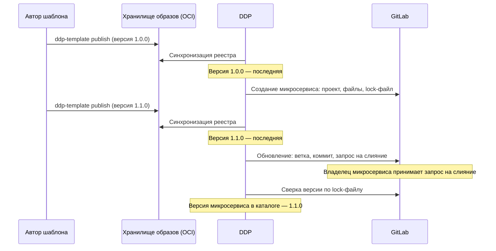

Шаблоны микросервисов задают структуру репозитория нового микросервиса: код-заготовку, CI/CD, манифесты развёртывания и конфигурацию.
Deckhouse Development Portal (DDP, портал) создаёт репозиторий микросервиса из шаблона, а при выходе новой версии шаблона переносит изменения в репозиторий через запрос на слияние.


Реестр шаблонов и обновление из шаблона — экспериментальная функциональность. Формат пакета, состав настроек и API могут измениться в следующих выпусках без сохранения обратной совместимости.


## Основные понятия

Механизм шаблонов использует следующие понятия:

- **пакет шаблона** — директория с манифестом `template.yaml`, схемой параметров `values.yaml` и файлами на Go-шаблонах. Пакет публикуется в хранилище образов контейнеров как OCI-артефакт; версия пакета — тег артефакта в формате semver;
- **реестр шаблонов** — подключения портала к хранилищам образов контейнеров, в которых опубликованы пакеты. Портал синхронизирует реестр по расписанию и ведёт каталог версий шаблонов;
- **последняя версия** — рекомендованная версия шаблона: максимальная стабильная версия среди доступных. Её предлагает мастер создания и на неё обновляются микросервисы;
- **lock-файл** — файл `.ddp/template.lock.yaml` в репозитории микросервиса. Хранит идентификатор шаблона, его версию и значения параметров, с которыми создан репозиторий;
- **привязка микросервиса к шаблону** — параметры сущности микросервиса в каталоге: идентификатор шаблона, версия, реестр и политика обновления;
- **действия по шаблонам** — процессы создания, развёртывания, удаления с окружения и обновления, привязанные к конкретному шаблону в правилах маппинга главной.

## Жизненный цикл шаблона

Схема ниже показывает путь от публикации шаблона до обновления репозитория микросервиса:

Этапы жизненного цикла:

1. Автор шаблона готовит пакет и публикует версию утилитой `ddp-template`. Формат пакета описан в разделе [«Пакет шаблона»](packs/).
1. Портал синхронизирует [реестр шаблонов](registry/) и добавляет версию в каталог версий.
1. Администратор привязывает к шаблону процессы в блоке «Действия по шаблонам» [правил маппинга](../home/mapping/#действия-по-шаблонам).
1. Разработчик создаёт микросервис в разделе главной «Создать микросервис». Процесс создания создаёт проект GitLab, записывает в него отрисованные файлы шаблона и lock-файл, регистрирует микросервис в каталоге.
1. При выходе новой версии шаблона портал показывает в карточке микросервиса уведомление «Доступна версия {version}». Обновление запускается кнопкой «Обновить» или автоматически.
1. Процесс обновления создаёт ветку с изменениями шаблона и открывает запрос на слияние. После принятия запроса на слияние портал обновляет версию шаблона микросервиса в каталоге.

Подробно механизм обновления описан в разделе [«Обновление из шаблона»](updates/).

## Роли участников

С шаблонами работают разные участники:

| Участник | Задачи | Где описано |
| --- | --- | --- |
| Автор шаблона | Готовит пакет, выбирает стратегию обновления, публикует версии | [«Пакет шаблона»](packs/) |
| Администратор портала | Подключает хранилища образов, настраивает синхронизацию и автоматическое обновление, привязывает процессы к шаблонам | [«Реестр шаблонов»](registry/), [«Правила маппинга»](../home/mapping/#действия-по-шаблонам) |
| Разработчик | Создаёт микросервис из шаблона, принимает запрос на слияние с обновлением | [«Микросервисы» в руководстве пользователя](../../user/home/microservices/) |

## Ограничения

Механизм шаблонов имеет следующие ограничения:

| Ограничение | Описание |
| --- | --- |
| Хранилище пакетов | Только хранилища образов контейнеров с OCI Distribution Spec v2, например Harbor, GitLab Container Registry, Docker Registry |
| Система контроля версий | Только GitLab. Репозиторий микросервиса доступен по HTTPS на хосте внешнего сервиса GitLab |
| Версии | Только строгий semver без префикса `v`, например `1.2.0`. Опубликованную версию перезаписать нельзя |
| Удаление файлов | Обновление не удаляет файлы из репозитория. Файлы, удалённые или переименованные в новой версии шаблона, удаляются вручную |
| Промежуточные версии | Обновление переводит репозиторий сразу на последнюю версию шаблона, промежуточные версии не применяются по очереди |
| Слияние | Портал не принимает запрос на слияние с обновлением автоматически |
| Привязка к реестру | Микросервис обновляется только из того реестра, из которого создан. Если последняя версия шаблона пришла из другого реестра, обновление микросервису не предлагается |
| Микросервисы без lock-файла | Репозитории, созданные без lock-файла `.ddp/template.lock.yaml`, обновить из шаблона нельзя |
| Новые шаблоны | Для каждого нового шаблона процессы привязываются вручную в правилах маппинга главной |


Пример [«Автоматическое обновление сервисов»](../../examples/service-autoupdates/) описывает настройку обновления на действиях, автоматизациях и Git-тегах шаблона без реестра шаблонов.
Механизм, описанный в этом разделе, работает с пакетами шаблонов из OCI-реестра и настраивается без собственных автоматизаций.

